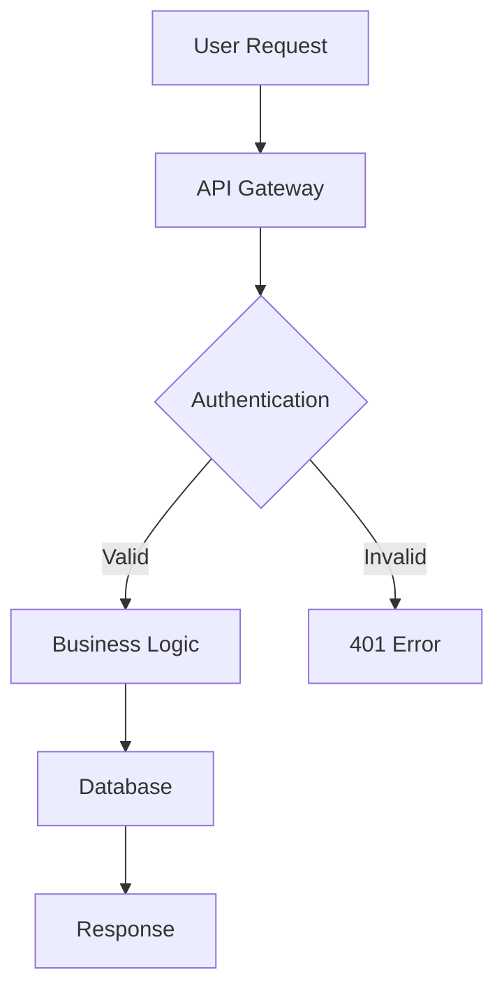

# Documentation Session Template

> **Template Type:** Technical Documentation & Code Comments
> **Version:** 1.0
> **Last Updated:** October 17, 2025

---

## 🎯 Purpose

For creating or updating technical documentation, API docs, README files, and code comments.

---

## 📋 Required Context Documents

**IMPORTANT:** Before starting this session, load the following context documents:

### Core Contexts (Always Load)
- `ai-contexts/code-workflow.md` - Standard workflow and task tracking
- `ai-contexts/master-context.md` - General principles and conventions

### Documentation-Specific Contexts (Load based on doc type)
- `ai-contexts/backend/backend-api-context.md` - For API documentation
- `ai-contexts/frontend/component-context.md` - For component documentation
- `ai-contexts/backend/database-context.md` - For database schema docs
- `ai-contexts/testing/unit-testing-context.md` - For testing documentation

### Optional Contexts
- Domain-specific contexts for the module being documented

**How to load:** Use the Read tool to load each relevant context document before beginning documentation work.

---

## 📚 Documentation Type

<!-- Select the type of documentation needed -->

**Documentation Category:**
- [ ] API Documentation (OpenAPI/Swagger)
- [ ] README File
- [ ] Code Comments (JSDoc/TSDoc)
- [ ] Architecture Documentation
- [ ] Setup/Installation Guide
- [ ] User Guide/Manual
- [ ] Database Schema Documentation
- [ ] Deployment Documentation
- [ ] Troubleshooting Guide
- [ ] Contributing Guidelines

**Target Audience:**
- [ ] Developers (internal team)
- [ ] External contributors
- [ ] End users
- [ ] System administrators
- [ ] API consumers

---

## 🎯 Documentation Scope

**What needs to be documented:**


**Files/Modules Affected:**


**Current State:**
- [ ] No documentation exists
- [ ] Documentation outdated
- [ ] Documentation incomplete
- [ ] Documentation needs restructuring

---

## 📝 Content Requirements

### For API Documentation

**Endpoints to Document:**


**Required Information:**
- [ ] Endpoint URL and HTTP method
- [ ] Request parameters (query, path, body)
- [ ] Request/response examples
- [ ] Authentication requirements
- [ ] Error codes and messages
- [ ] Rate limiting information
- [ ] Versioning details

### For README Files

**Sections Required:**
- [ ] Project title and description
- [ ] Features list
- [ ] Installation instructions
- [ ] Configuration setup
- [ ] Usage examples
- [ ] API reference (if applicable)
- [ ] Contributing guidelines
- [ ] License information
- [ ] Contact/support information

### For Code Comments

**Documentation Standards:**
- [ ] JSDoc/TSDoc format
- [ ] Function descriptions
- [ ] Parameter descriptions with types
- [ ] Return value descriptions
- [ ] Usage examples
- [ ] Edge cases and warnings
- [ ] Related functions/dependencies

**Example:**
```typescript
/**
 * Calculates the total cost of a project including all transactions
 *
 * @param projectId - The unique identifier of the project
 * @param options - Optional configuration for the calculation
 * @param options.includeExpenses - Include expense transactions (default: true)
 * @param options.includeIncome - Include income transactions (default: true)
 *
 * @returns The total cost as a number
 *
 * @throws {ProjectNotFoundError} When project doesn't exist
 * @throws {UnauthorizedError} When user lacks permission
 *
 * @example
 * ```typescript
 * const total = await calculateProjectCost('project-123', {
 *   includeExpenses: true,
 *   includeIncome: false
 * })
 * ```
 */
async function calculateProjectCost(
  projectId: string,
  options?: CostCalculationOptions
): Promise<number> {
  // Implementation
}
```

### For Architecture Documentation

**Sections Required:**
- [ ] System overview
- [ ] Architecture diagrams
- [ ] Component relationships
- [ ] Data flow diagrams
- [ ] Technology stack
- [ ] Design decisions and rationale
- [ ] Scalability considerations
- [ ] Security architecture

---

## 🖼️ Visual Documentation

**Diagrams Needed:**
- [ ] Architecture diagrams
- [ ] Flowcharts
- [ ] Entity-relationship diagrams (ERD)
- [ ] Sequence diagrams
- [ ] Component diagrams

**Format:**
- [ ] Mermaid diagrams (inline)
- [ ] Draw.io/Lucidchart
- [ ] Screenshots
- [ ] Wireframes

**Example Mermaid Diagram:**
````markdown

````

---

## 📋 Documentation Checklist

**Content Quality:**
- [ ] Clear and concise language
- [ ] No jargon (or jargon explained)
- [ ] Examples provided
- [ ] Code snippets tested and working
- [ ] Links to related documentation
- [ ] Table of contents (for long docs)
- [ ] Search-friendly headings

**Technical Accuracy:**
- [ ] Information is up to date
- [ ] Code examples match current API
- [ ] Version numbers accurate
- [ ] Dependencies listed correctly
- [ ] Configuration values correct

**Formatting:**
- [ ] Markdown properly formatted
- [ ] Code blocks have language specified
- [ ] Headings follow hierarchy (h1, h2, h3)
- [ ] Lists are properly formatted
- [ ] Tables used where appropriate

**Accessibility:**
- [ ] Alt text for images
- [ ] Clear heading structure
- [ ] Descriptive link text
- [ ] Color not sole indicator

---

## 🔄 Maintenance Plan

**Update Triggers:**
- [ ] API changes
- [ ] Feature additions
- [ ] Breaking changes
- [ ] Bug fixes affecting usage
- [ ] Configuration changes

**Review Schedule:**
- [ ] Quarterly
- [ ] On each major release
- [ ] On significant changes
- [ ] As needed

---

## 📊 Documentation Structure

**Proposed Outline:**
```
1. Introduction
   - Purpose
   - Prerequisites

2. Main Content
   - Section 1
   - Section 2

3. Examples
   - Basic usage
   - Advanced usage

4. Reference
   - API reference
   - Configuration options

5. Troubleshooting
   - Common issues
   - FAQ
```

---

## ✅ Examples to Include

**Use Cases:**
1.
2.
3.

**Code Examples:**
```typescript
// Example 1: Basic usage

// Example 2: Advanced usage

// Example 3: Error handling
```

---

## 🎨 Style Guide

**Documentation Standards:**
- **Tone:** Professional, clear, helpful
- **Code Style:** Follow project conventions
- **Naming:** Consistent with codebase
- **Format:** Markdown unless specified otherwise
- **Line Length:** 100 characters max for readability

**Terminology:**
- Use consistent terms throughout
- Define acronyms on first use
- Link to glossary when available

---

## 📝 Session Notes

<!-- Add any additional context, references, or special requirements -->

---

## ✅ Start Session

Ready to begin documentation work. Please:
1. Review the documentation scope and requirements
2. Analyze existing documentation (if any)
3. Identify gaps and areas for improvement
4. Propose documentation structure
5. Create clear, accurate, and helpful content
6. Include relevant examples and diagrams
7. Ensure consistency with project conventions

---
