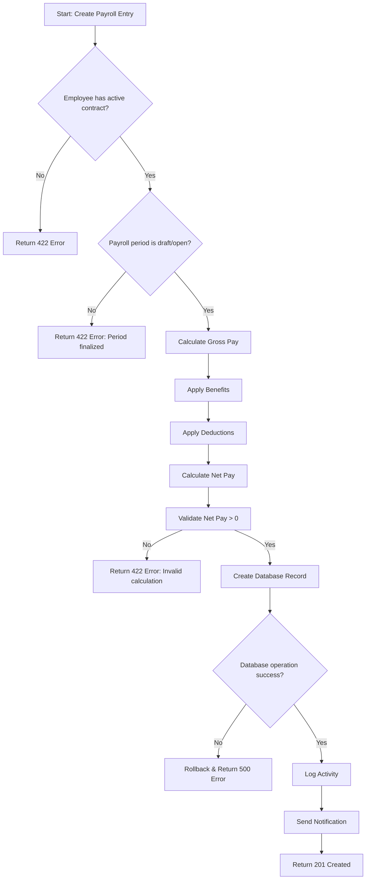
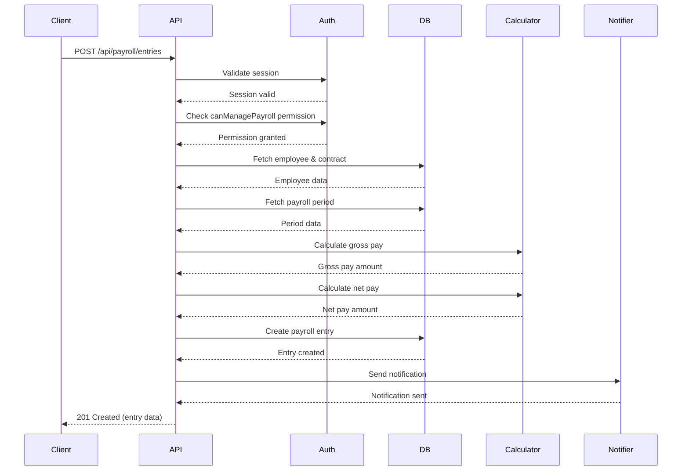

# Documentation Session Template

> **Template Type:** Technical Documentation & Code Comments
> **Version:** 1.0
> **Last Updated:** October 17, 2025

---

## 🎯 Purpose

For creating or updating technical documentation, API docs, README files, and code comments.

---

## 📋 Required Context Documents

**IMPORTANT:** Before starting this session, load the following context documents:

### Core Contexts (Always Load)
- `ai-contexts/code-workflow.md` - Standard workflow and task tracking
- `ai-contexts/master-context.md` - General principles and conventions

### Documentation-Specific Contexts (Load based on doc type)
- `ai-contexts/backend/backend-api-context.md` - For API documentation
- `ai-contexts/frontend/component-context.md` - For component documentation
- `ai-contexts/backend/database-context.md` - For database schema docs
- `ai-contexts/testing/unit-testing-context.md` - For testing documentation

### Optional Contexts
- Domain-specific contexts for the module being documented

**How to load:** Use the Read tool to load each relevant context document before beginning documentation work.

---

## 📚 Documentation Type

<!-- Select the type of documentation needed -->

**Documentation Category:**
- [x] API Documentation (OpenAPI/Swagger)
- [x] README File
- [x] Code Comments (JSDoc/TSDoc)
- [ ] Architecture Documentation
- [ ] Setup/Installation Guide
- [ ] User Guide/Manual
- [ ] Database Schema Documentation
- [ ] Deployment Documentation
- [ ] Troubleshooting Guide
- [ ] Contributing Guidelines

**Target Audience:**
- [x] Developers (internal team)
- [ ] External contributors
- [ ] End users
- [ ] System administrators
- [x] API consumers

---

## 🎯 Documentation Scope

**What needs to be documented:**
The Payroll Module API endpoints and components need comprehensive documentation. Currently has minimal code comments and no API documentation. New team members struggle to understand how payroll calculations work and how to use the endpoints.

**Files/Modules Affected:**
- `/src/app/api/payroll/**` - All payroll API endpoints (8 endpoints)
- `/src/components/payroll/**` - Payroll UI components (5 components)
- `/src/lib/payroll-calculations.ts` - Core calculation logic (critical)
- `/prisma/schema.prisma` - PayrollEntry, PayrollPeriod models
- `/docs/api/payroll-api.md` - New API documentation file (to create)
- `/docs/guides/payroll-system.md` - New developer guide (to create)

**Current State:**
- [x] No documentation exists - API endpoints have zero documentation
- [ ] Documentation outdated
- [ ] Documentation incomplete
- [ ] Documentation needs restructuring

**Pain Points:**
- New developers don't understand payroll calculation logic
- No examples of how to use payroll APIs
- Unclear what business rules are enforced
- No documentation of tax calculation formulas
- Missing error code explanations
- No guidance on testing payroll features

---

## 📝 Content Requirements

### For API Documentation

**Endpoints to Document:**

1. `POST /api/payroll/entries` - Create payroll entry
2. `GET /api/payroll/entries` - List payroll entries
3. `GET /api/payroll/entries/[entryId]` - Get single entry
4. `PUT /api/payroll/entries/[entryId]` - Update entry (draft only)
5. `DELETE /api/payroll/entries/[entryId]` - Delete entry (draft only)
6. `POST /api/payroll/periods` - Create payroll period
7. `GET /api/payroll/periods` - List payroll periods
8. `PUT /api/payroll/periods/[periodId]` - Update period status

**Required Information:**
- [x] Endpoint URL and HTTP method
- [x] Request parameters (query, path, body)
- [x] Request/response examples (realistic data)
- [x] Authentication requirements (role/permissions)
- [x] Error codes and messages (all possible errors)
- [ ] Rate limiting information (not implemented yet)
- [ ] Versioning details (not implemented yet)

**Additional Requirements:**
- Explain payroll calculation formulas (gross pay, net pay)
- Document benefits and deductions handling
- Explain payroll period lifecycle (draft → open → finalized → paid)
- Provide curl examples for testing
- Document business rules (e.g., can't edit finalized period)

### For README Files

**Sections Required:**
- [x] Project title and description - "Payroll Management System"
- [x] Features list - Entry management, period tracking, calculations
- [ ] Installation instructions - Not needed (part of main app)
- [ ] Configuration setup - Environment variables for payroll
- [x] Usage examples - How to calculate payroll, create entries
- [x] API reference (if applicable) - Link to API docs
- [ ] Contributing guidelines - Part of main CONTRIBUTING.md
- [ ] License information - Part of main LICENSE
- [ ] Contact/support information - Link to main support

**README Location:**
`/docs/guides/payroll-system.md`

**README Purpose:**
Onboarding guide for developers joining payroll team. Should explain:
- What the payroll system does
- How payroll calculations work
- How to test payroll features
- Common troubleshooting scenarios
- Links to detailed API docs

### For Code Comments

**Documentation Standards:**
- [x] JSDoc/TSDoc format
- [x] Function descriptions
- [x] Parameter descriptions with types
- [x] Return value descriptions
- [x] Usage examples
- [x] Edge cases and warnings
- [x] Related functions/dependencies

**Priority Files for Comments:**
1. `/src/lib/payroll-calculations.ts` - CRITICAL (complex formulas)
2. `/src/app/api/payroll/entries/route.ts` - HIGH (main entry creation)
3. `/src/app/api/payroll/periods/[periodId]/route.ts` - HIGH (status updates)
4. `/src/components/payroll/payroll-entry-form.tsx` - MEDIUM (UI logic)
5. `/src/components/payroll/payroll-calculation-display.tsx` - MEDIUM (display logic)

**Example for payroll-calculations.ts:**
```typescript
/**
 * Calculates the gross pay for a payroll entry including base salary,
 * overtime pay, bonuses, and commissions.
 *
 * Formula: Gross Pay = Base Salary + Overtime Pay + Bonuses + Commissions
 *
 * @param baseSalary - The employee's base salary for the period
 * @param overtimeHours - Number of overtime hours worked (default: 0)
 * @param overtimeRate - Hourly rate for overtime (default: 1.5x base rate)
 * @param bonuses - Array of bonus amounts to include
 * @param commissions - Array of commission amounts to include
 *
 * @returns The calculated gross pay before deductions
 *
 * @throws {ValidationError} If baseSalary is negative or NaN
 * @throws {ValidationError} If overtimeHours is negative
 *
 * @example
 * ```typescript
 * // Employee with $5000 monthly salary, 10 hours overtime at $50/hr
 * const grossPay = calculateGrossPay(
 *   5000,           // base salary
 *   10,             // overtime hours
 *   50,             // overtime rate
 *   [500],          // bonuses
 *   [250]           // commissions
 * )
 * // Returns: 6250 (5000 + 500 (overtime) + 500 + 250)
 * ```
 *
 * @remarks
 * This function does NOT include deductions or taxes. Use `calculateNetPay()`
 * for final take-home pay after all deductions.
 *
 * @see {@link calculateNetPay} - For calculating final net pay
 * @see {@link applyDeductions} - For applying deductions to gross pay
 *
 * @since 1.0.0
 */
export function calculateGrossPay(
  baseSalary: number,
  overtimeHours: number = 0,
  overtimeRate: number,
  bonuses: number[] = [],
  commissions: number[] = []
): number {
  // Validate inputs
  if (baseSalary < 0 || isNaN(baseSalary)) {
    throw new ValidationError('Base salary must be a positive number')
  }

  if (overtimeHours < 0) {
    throw new ValidationError('Overtime hours cannot be negative')
  }

  // Calculate overtime pay
  const overtimePay = overtimeHours * overtimeRate

  // Sum bonuses and commissions
  const totalBonuses = bonuses.reduce((sum, bonus) => sum + bonus, 0)
  const totalCommissions = commissions.reduce((sum, comm) => sum + comm, 0)

  // Calculate gross pay
  const grossPay = baseSalary + overtimePay + totalBonuses + totalCommissions

  return grossPay
}

/**
 * Calculates net pay by applying deductions to gross pay.
 *
 * Formula: Net Pay = Gross Pay - Total Deductions
 *
 * Deductions include:
 * - Federal tax
 * - State tax
 * - Social Security (6.2% up to wage base)
 * - Medicare (1.45%)
 * - Health insurance premiums
 * - Retirement contributions (401k, etc.)
 * - Other deductions (garnishments, loans, etc.)
 *
 * @param grossPay - The gross pay amount (before deductions)
 * @param deductions - Object containing all deduction amounts
 *
 * @returns The net pay amount (take-home pay)
 *
 * @example
 * ```typescript
 * const netPay = calculateNetPay(5000, {
 *   federalTax: 750,
 *   stateTax: 250,
 *   socialSecurity: 310,
 *   medicare: 72.5,
 *   healthInsurance: 200,
 *   retirement401k: 300
 * })
 * // Returns: 3117.5 (5000 - 1882.5 total deductions)
 * ```
 */
export function calculateNetPay(
  grossPay: number,
  deductions: PayrollDeductions
): number {
  // Implementation...
}
```

### For Architecture Documentation

Not required for this session (focusing on API and code docs).

---

## 🖼️ Visual Documentation

**Diagrams Needed:**
- [x] Flowcharts - Payroll calculation workflow
- [x] Sequence diagrams - Entry creation flow with validations
- [ ] Entity-relationship diagrams (ERD) - Already in database docs
- [ ] Component diagrams
- [ ] Architecture diagrams

**Format:**
- [x] Mermaid diagrams (inline) - For easy maintenance in markdown
- [ ] Draw.io/Lucidchart
- [ ] Screenshots
- [ ] Wireframes

**Example Mermaid Diagram:**

````markdown



````

---

## 📋 Documentation Checklist

**Content Quality:**
- [x] Clear and concise language
- [x] No jargon (or jargon explained) - Define "gross pay", "net pay", etc.
- [x] Examples provided - Multiple examples per endpoint
- [x] Code snippets tested and working
- [x] Links to related documentation
- [x] Table of contents (for long docs)
- [x] Search-friendly headings

**Technical Accuracy:**
- [x] Information is up to date - Documenting current implementation
- [x] Code examples match current API
- [ ] Version numbers accurate - Not versioned yet
- [x] Dependencies listed correctly
- [x] Configuration values correct

**Formatting:**
- [x] Markdown properly formatted
- [x] Code blocks have language specified (```typescript, ```json)
- [x] Headings follow hierarchy (h1, h2, h3)
- [x] Lists are properly formatted
- [x] Tables used where appropriate

**Accessibility:**
- [x] Alt text for images - N/A (using mermaid diagrams)
- [x] Clear heading structure
- [x] Descriptive link text
- [x] Color not sole indicator

---

## 🔄 Maintenance Plan

**Update Triggers:**
- [x] API changes - Update docs immediately with code changes
- [x] Feature additions - Add new endpoint docs
- [x] Breaking changes - Highlight in docs with migration guide
- [x] Bug fixes affecting usage - Update examples if behavior changes
- [x] Configuration changes - Update environment variable docs

**Review Schedule:**
- [x] Quarterly - Review all payroll docs for accuracy
- [x] On each major release - Update changelog
- [ ] On significant changes - Immediate updates
- [x] As needed - When confusion reported

**Ownership:**
- Primary: Payroll module lead developer
- Secondary: Technical writer (if available)
- Reviews: Senior developers during PR reviews

---

## 📊 Documentation Structure

**Proposed Outline for `/docs/api/payroll-api.md`:**
```
# Payroll Management API Documentation

## Table of Contents
1. Overview
2. Authentication & Authorization
3. Core Concepts
4. API Endpoints
5. Calculation Logic
6. Error Handling
7. Examples
8. Testing
9. Troubleshooting

## 1. Overview
- What is the payroll system?
- Key features
- System architecture (high-level)

## 2. Authentication & Authorization
- Required authentication (NextAuth session)
- Required permissions (canManagePayroll)
- Business-level access control

## 3. Core Concepts
- Payroll Period lifecycle (draft → open → finalized → paid)
- Payroll Entry structure
- Benefits vs. Deductions
- Gross Pay vs. Net Pay calculations

## 4. API Endpoints

### 4.1 Payroll Entries
#### POST /api/payroll/entries
- Description
- Authentication requirements
- Request format
- Response format
- Error codes
- Examples

#### GET /api/payroll/entries
- Description
- Query parameters
- Filtering options
- Pagination
- Examples

[... continue for all endpoints ...]

### 4.2 Payroll Periods
[... similar structure ...]

## 5. Calculation Logic
- Gross pay formula
- Deductions breakdown
- Net pay formula
- Benefits handling
- Overtime calculations

## 6. Error Handling
- Error code reference
- Common error scenarios
- Troubleshooting tips

## 7. Examples
- Complete workflow examples
- Curl commands
- JavaScript/TypeScript examples
- Common use cases

## 8. Testing
- How to test payroll features
- Test data setup
- Validation checklist

## 9. Troubleshooting
- Common issues
- FAQ
- Getting help
```

**Proposed Outline for `/docs/guides/payroll-system.md`:**
```
# Payroll System Developer Guide

## Quick Start
- What you need to know
- Prerequisites
- Key concepts

## Architecture Overview
- Database models
- API structure
- Frontend components
- Calculation service

## Development Workflow
- Local setup
- Creating test data
- Running payroll calculations
- Testing edge cases

## Common Tasks
- Adding a new deduction type
- Modifying calculation logic
- Adding payroll reports
- Integrating with external systems

## Best Practices
- Error handling
- Data validation
- Performance considerations
- Security considerations

## Troubleshooting
- Common issues
- Debugging tips
- FAQ

## Resources
- API documentation link
- Database schema
- Code examples
- Related documentation
```

---

## ✅ Examples to Include

**Use Cases:**

1. **Basic Payroll Entry Creation**
   - Employee with base salary only
   - No benefits, no deductions, no overtime
   - Simplest case for understanding

2. **Complex Payroll Entry**
   - Base salary + overtime + benefits + deductions
   - Shows all calculation steps
   - Demonstrates validation rules

3. **Payroll Period Workflow**
   - Create period (draft)
   - Add entries to period
   - Finalize period (lock entries)
   - Mark as paid

**Code Examples:**
```typescript
// Example 1: Create simple payroll entry
const response = await fetch('/api/payroll/entries', {
  method: 'POST',
  headers: {
    'Content-Type': 'application/json',
    'Authorization': 'Bearer YOUR_TOKEN'
  },
  body: JSON.stringify({
    payrollPeriodId: 'period-123',
    employeeId: 'emp-456',
    baseSalary: 5000,
    notes: 'Standard monthly salary'
  })
})

const entry = await response.json()
console.log('Created entry:', entry.data)
// Output:
// {
//   id: 'entry-789',
//   baseSalary: 5000,
//   grossPay: 5000,
//   netPay: 5000,
//   status: 'draft'
// }

// Example 2: Create entry with overtime and benefits
const complexEntry = await fetch('/api/payroll/entries', {
  method: 'POST',
  headers: { /* ... */ },
  body: JSON.stringify({
    payrollPeriodId: 'period-123',
    employeeId: 'emp-456',
    baseSalary: 5000,
    overtimeHours: 10,
    overtimeRate: 50,
    benefits: [
      { benefitId: 'benefit-health', amount: 200 }
    ],
    deductions: [
      { deductionId: 'deduction-tax', amount: 750 }
    ],
    notes: 'Includes overtime for project deadline'
  })
})

// Calculation breakdown:
// Base Salary: $5,000
// Overtime: 10 hours × $50 = $500
// Gross Pay: $5,500
// + Benefits: $200
// - Deductions: $750
// Net Pay: $4,950

// Example 3: Error handling
try {
  const response = await fetch('/api/payroll/entries', {
    method: 'POST',
    body: JSON.stringify({
      payrollPeriodId: 'invalid-period',
      employeeId: 'emp-456',
      baseSalary: 5000
    })
  })

  if (!response.ok) {
    const error = await response.json()
    console.error('Error:', error)
    // Output: { error: 'Not found', message: 'Payroll period not found' }
  }
} catch (err) {
  console.error('Network error:', err)
}
```

**Curl Examples:**
```bash
# Create payroll entry
curl -X POST http://localhost:8080/api/payroll/entries \
  -H "Content-Type: application/json" \
  -H "Authorization: Bearer YOUR_TOKEN" \
  -d '{
    "payrollPeriodId": "period-123",
    "employeeId": "emp-456",
    "baseSalary": 5000,
    "overtimeHours": 10,
    "overtimeRate": 50
  }'

# List payroll entries with filtering
curl -X GET "http://localhost:8080/api/payroll/entries?periodId=period-123&status=approved" \
  -H "Authorization: Bearer YOUR_TOKEN"

# Get single entry details
curl -X GET http://localhost:8080/api/payroll/entries/entry-789 \
  -H "Authorization: Bearer YOUR_TOKEN"
```

---

## 🎨 Style Guide

**Documentation Standards:**
- **Tone:** Professional, clear, helpful, encouraging
- **Code Style:** Follow TypeScript style guide
- **Naming:** Use exact API field names (camelCase)
- **Format:** Markdown with mermaid diagrams
- **Line Length:** 100 characters max for readability

**Terminology:**
- "Payroll entry" not "payroll record"
- "Gross pay" not "total salary"
- "Net pay" not "take-home"
- "Deduction" not "withholding" (use consistently)
- "Benefit" not "addition" (use consistently)

**Acronyms:**
- Define on first use: "Gross pay (total before deductions)"
- Link to glossary when available

---

## 📝 Session Notes

<!-- Add any additional context, references, or special requirements -->

**Context:**
- Payroll module is 6 months old, no docs written yet
- New developer spent 3 days figuring out calculation logic
- Several bugs due to misunderstanding of business rules
- Team wants comprehensive docs before next sprint
- Planning to hire 2 new developers next month

**Stakeholder Requirements:**
- CTO: "Make it easy for new devs to contribute"
- Payroll lead: "Document WHY decisions were made, not just HOW"
- QA team: "Need testing examples for each edge case"
- Product manager: "Explain business rules clearly"

**Resources Available:**
- 2 days allocated for documentation work
- Can interview senior developer for domain knowledge
- Access to accounting team for formula validation
- Existing payroll period management docs (partial)

**Success Metrics:**
- New developer can create payroll entry within 2 hours (vs. 3 days currently)
- Documentation prevents at least 5 support questions per month
- Code review comments about "add documentation" decrease by 80%

---

## ✅ Start Session

Ready to begin documentation work. Please:
1. Load required context documents (backend-api-context.md, code-workflow.md, database-context.md)
2. Review the documentation scope and requirements
3. Analyze existing code in payroll module:
   - Read `/lib/payroll-calculations.ts` to understand formulas
   - Read API endpoint files to understand request/response formats
   - Identify complex logic that needs extra explanation
4. Create comprehensive API documentation:
   - Document all 8 endpoints with examples
   - Explain calculation formulas step-by-step
   - Provide curl and TypeScript examples
   - Document all error codes
5. Add JSDoc comments to critical files:
   - Start with `/lib/payroll-calculations.ts` (highest priority)
   - Add comments to complex functions
   - Include @example tags with realistic data
   - Link related functions with @see tags
6. Create developer guide:
   - Explain payroll system architecture
   - Document common workflows
   - Provide troubleshooting section
7. Add mermaid diagrams:
   - Flowchart for payroll entry creation
   - Sequence diagram showing validation flow
8. Ensure consistency with project conventions:
   - Use camelCase for field names in examples
   - Follow existing documentation patterns
   - Match tone/style of other docs

**Deliverables:**
1. `/docs/api/payroll-api.md` - Complete API documentation (estimate: 1000+ lines)
2. `/docs/guides/payroll-system.md` - Developer guide (estimate: 500+ lines)
3. JSDoc comments in `/lib/payroll-calculations.ts` (estimate: 300+ lines)
4. JSDoc comments in 2-3 API route files (estimate: 200+ lines)
5. Mermaid diagrams (2-3 diagrams)

**Timeline:**
- Day 1 Morning: API documentation + diagrams
- Day 1 Afternoon: JSDoc comments in calculation file
- Day 2 Morning: JSDoc comments in API files
- Day 2 Afternoon: Developer guide + final review

---
